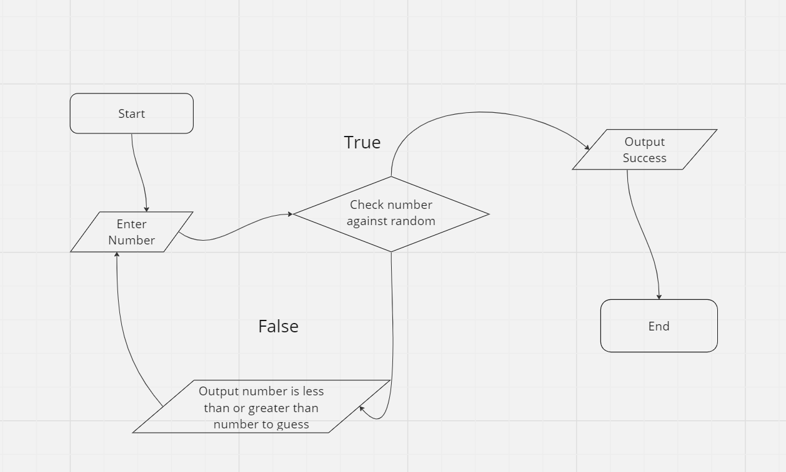

# Number Guesser Game

This is a simple number guessing game implemented in Java.

## Game.java

The `Game.java` file contains the implementation of the `Game` class, which represents the number guessing game. It includes methods for generating a random number, accepting user guesses, and determining if the guess is correct.

## Main.java

The `Main.java` file contains the main entry point of the application. It creates an instance of the `Game` class and starts the game by calling the appropriate methods.

## How to Play

1. Run the `Main.java` file to start the game.
2. The program will generate a random number between 1 and 100.
3. Enter your guess and press enter.
4. The program will provide feedback on whether your guess is too high, too low, or correct.
5. Keep guessing until you guess the correct number.

## Flowchart



## Sample
```
waltob123@GOKyiv:~/Documents/java-tutorials/basics$ javac number_guesser/Game.java  && javac number_guesser/Main.java && java number_guesser.Main 
Welcome to the number guesser game!
========================================
Please enter a number between 0 and 100: 
50
Your guess is too high
Please enter a number between 0 and 100: 
20
Your guess is too low
Please enter a number between 0 and 100: 
40
Your guess is too low
Please enter a number between 0 and 100: 
45
Your guess is too high
Please enter a number between 0 and 100: 
43
Your guess is too high
Please enter a number between 0 and 100: 
44
Your guess is too high
Please enter a number between 0 and 100: 
42
Your guess is too high
Please enter a number between 0 and 100: 
41
You guessed the number after 8 times!
Thanks for playing!
waltob123@GOKyiv:~/Documents/java-tutorials/basics$ 
```

Have fun playing the Number Guesser Game!
